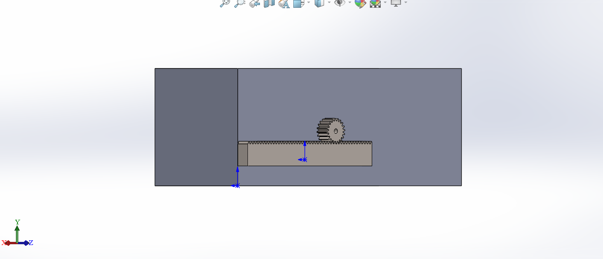
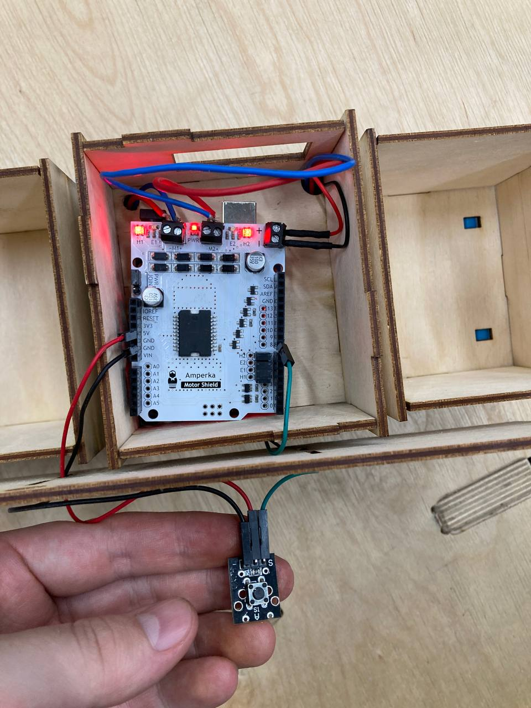
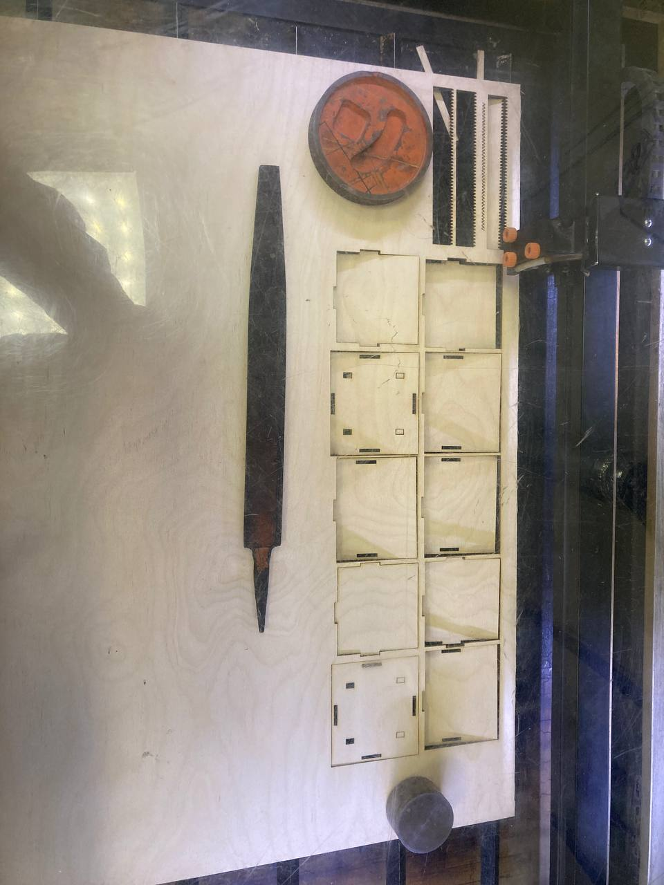
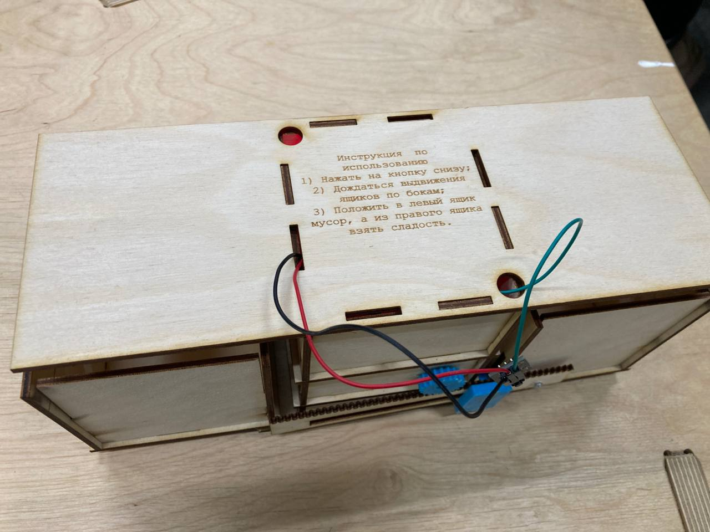

# Fedeer-for-students

**Оборудование** -  3D-принтер Prusa i3 MK3, Лазерный гравер GCC Spirit GLS100

**Инструменты** - Дрель, штангенциркуль

**Материалы** - PLA, фанерные листы, шуруп на 6 мм, клей

## Принцип работы 
При нажатии кнопки выдвига.тся два ящика по бокам, студент кладет мусор (крышечки) к левый ящик, а из правого берет конфету. На все действия у него есть 40 секунд.

[*Концепт*](https://docs.google.com/document/d/1_45J2s7cdX2l78xIIpT3HkgTbCCL-Cxg02LqHNaX1n0/edit?pli=1)

## 3Д Сборка



Рисунок 1 - 3D-модель кормушки в SolidWorks

## Электроника

Элементы: 

- Arduino Uno
- Troyka Shield
- Мотор
- Кнопка
- Батарейки



Рисунок 2 - Arduino подключенная ко всем элементам

## Изготовление и сборка



Рисунок 3 - Вырезка деталей кормушки

В ходе изготовления деталей, пришлось переделать боковые стенки верхнего отсека, так как их высота была недостаточна с учетом подключенных проводов.



Рисунок 4 - Вид кормушки собранной спереди

## Код

```c++
// Motor shield использует четыре контакта 4, 5, 6, 7 для управления моторами 
// 4 и 7 — для направления, 5 и 6 — для скорости
#define SPEED_1      5 
#define DIR_1        4
 
#define SPEED_2      6
#define DIR_2        7
 
#define dot  8


void setup() {
  // настраиваем выводы платы 4, 5, 6, 7 на вывод сигналов 
  for (int i = 4; i < 8; i++) {     
    pinMode(i, OUTPUT);
  }
  pinMode (dot, INPUT);
} 
 
void loop() {

  int btnVal = digitalRead(dot);


if (btnVal == 0)
{
  // устанавливаем направление мотора «M2» в одну сторону
  digitalWrite(DIR_2, HIGH);
  // включаем второй мотор на максимальной скорости
  analogWrite(SPEED_2, 80);
     // устанавливаем направление мотора «M1» в одну сторону
  digitalWrite(DIR_1, HIGH);
  // включаем мотор на максимальной скорости
  analogWrite(SPEED_1, 80);
  // ждём одну секунду
  delay(900);

  analogWrite(SPEED_1, 0);
  analogWrite(SPEED_2, 0);
  delay(2000);

 // устанавливаем направление мотора «M2» в одну сторону
  digitalWrite(DIR_2, LOW);
  // включаем второй мотор на максимальной скорости
  analogWrite(SPEED_2, 80);
     // устанавливаем направление мотора «M1» в одну сторону
  digitalWrite(DIR_1, LOW);
  // включаем мотор на максимальной скорости
  analogWrite(SPEED_1, 80);
  // ждём одну секунду
  delay(900);

   analogWrite(SPEED_1, 0);
  analogWrite(SPEED_2, 0);
 

  }
  else {


  analogWrite(SPEED_1, 0);
  analogWrite(SPEED_2, 0);
  }
 
 
}

```


## Тестирование


https://github.com/Alberyn/Fedeer-for-students/assets/78211591/1d7e41ed-eec5-428a-98bb-17cf1a2b2bfa


## Недочеты:

1. Из-за неточностей в расчетах, пришлось переделывать пару деталей.
2. Недостаток кода во временном лимите для действий студентов
3. Недостаточное фиксирование рейки для 100% и постоянного срабатывания конструкции. Иногда ящики не выдвигаются на всю длину.
